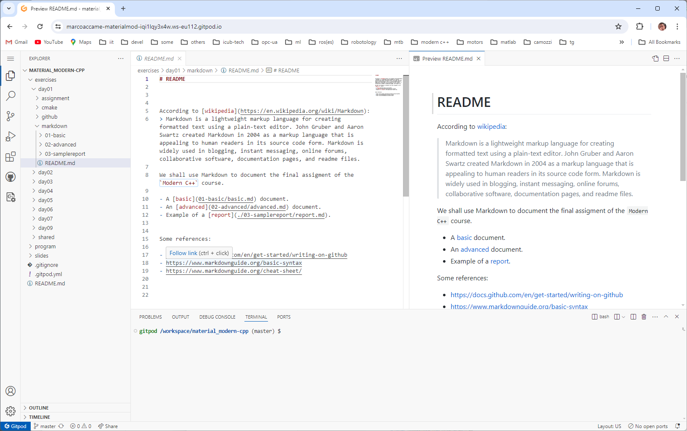

# The environment

We need an environment where to run our exercises. As they come with `Cmake` there are several possibilities. We propose two:

- a  `gitpod` environment ready to use with `Visual Studio Code`,
- a `Ubuntu` 2022.04 environment in `WSL2` with `Visual Studio Code`.


In the following are basic instructions for preparing these two environments.


## Setting up `gitpod`


This environment is ready to use and requires only a browser. Instructions of its use are in here.

In here are instructions about how to use `gitpod`


1. log in

   

2. then open a workspace w/ CTRL + O. Open your forked repository: `https://github.com/marcoaccame/material_modern-cpp`

   

   

4. after some preparation your environment will appear

   

   

5. use it for:

   - visualizing .md files
     
   
   - for compiling and running code
   
     
   
     
   
     
   
     
   
   - for debugging
   
     
   
     
   
     
   
     


## Setting up `Ubuntu`

This section will show how to setup the Ubuntu 20.04 environment for WSL2 in Windows. Similar settings apply to a native Ubuntu distribution.

The steps are:

- install Ubuntu 20.04 on WSL2
- install the development tools required to compile
- install and configure Visual Studio Code to run the debugger.

### Install Ubuntu on WSL2

TBD

### Install the compilation tools

The following are required
- `git`

  ```bash
  $ sudo apt install git -y
  $ git --version
  ```

- `cmake`

  ```bash
  $ sudo apt  install cmake
  $ cmake --version
  ```

- `ccmake`

  ```bash
  $ sudo apt install cmake-curses-gui
  $ ccmake --version
  ```
- `gcc` et al (gcc, g++ and make)

  ```bash
  $ sudo apt install build-essential
  $ gcc --version
  $ g++ --version
  $ make --version
  ```
  
- `gdb`

  ```bash
  $ sudo apt install gdb
  $ gdb --version
  ```

- `others`: tree, meld
  
  ```bash
  $ sudo apt install tree
  $ sudo apt install meld
  ```


### Install and launch VSC

Visual Studio Code can be installed either on windows via the Microsoft store or directly on Ubuntu. Then it can started from Ubuntu (but also from Windows).

See the following installation instructions:

- `Ubuntu`: https://code.visualstudio.com/docs/setup/linux
- `Windows`: https://code.visualstudio.com/docs/setup/windows


On Linux we start it w/ following command

  ```bash
  $ code
  ```


### Configure VSC

After we launch it we must configure it for using with C++ and for debugging with GDB, so we need to install the following extensions suggested by https://code.visualstudio.com/docs/languages/cpp. See also https://code.visualstudio.com/docs/cpp/cpp-debug.

- `ms-vscode.cpptools-extension-pack`

  

- `ms-vscode-remote.remote-wsl`

  


The above should be enough. However, it is important to:

- connect to wsl2 w/ CTRL + ALT + O

  

- make sure that the extensions are enabled also in wsl2.

  

  

  
