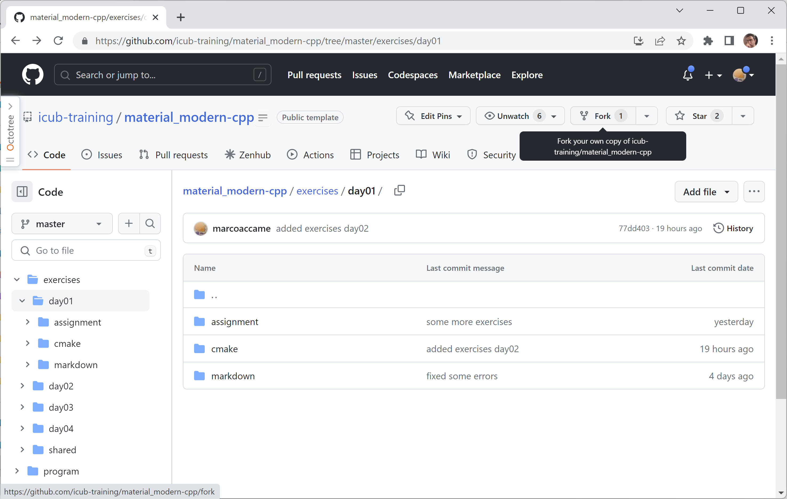
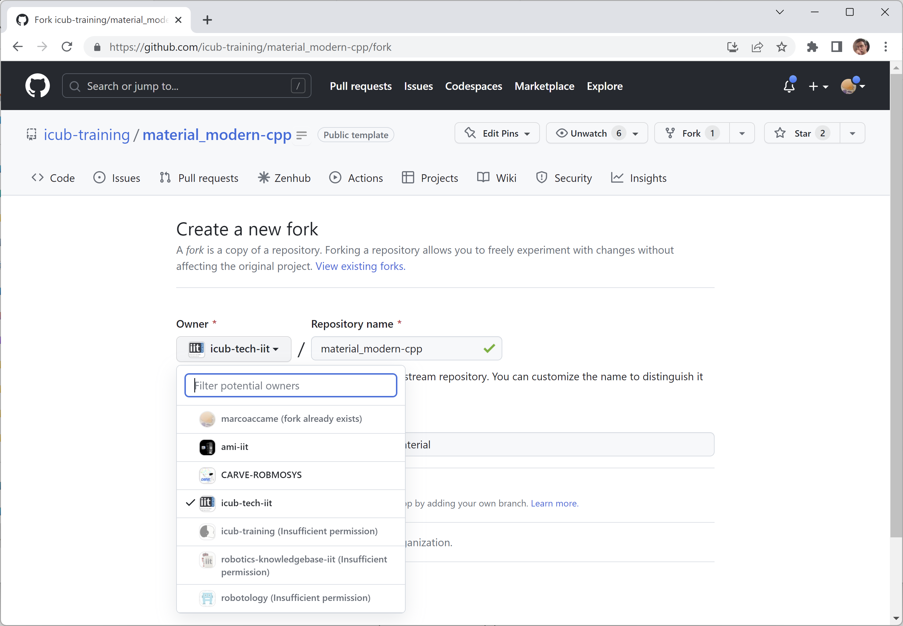

# Basic operativity in GitHub 


## Fork the repository

See pictures.






**Figure**. How to fork the repository


## Clone the repository

```bash
$ git clone https://github.com/USER/material_modern-cpp
$ cd material_modern-cpp
$
```

**Listing**. How to clone the forked repository


## Update your clone

```bash
$ git remote add orig https://github.com/icub-training/material_modern-cpp
$ git fetch orig
$ git checkout master
$ git pull
$ git rebase orig/master
$ git push --force-with-lease origin master
$
```

**Listing**. How to rebase your cloned repository vs the original


 