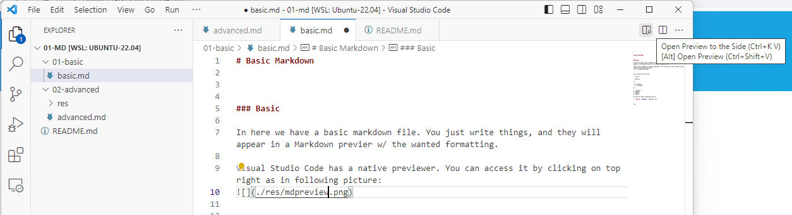
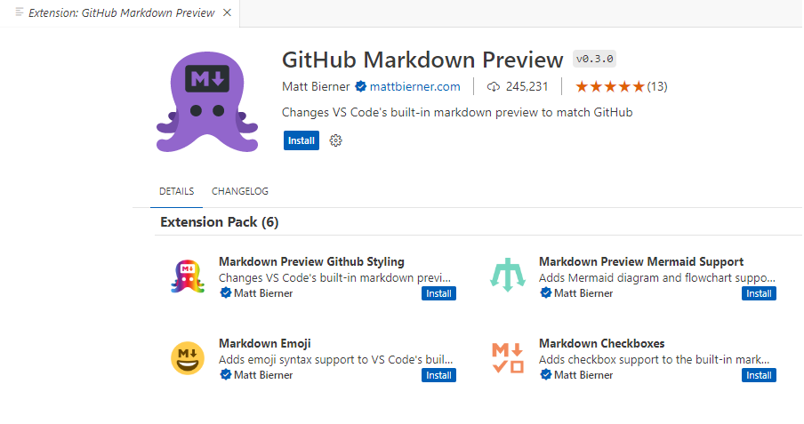
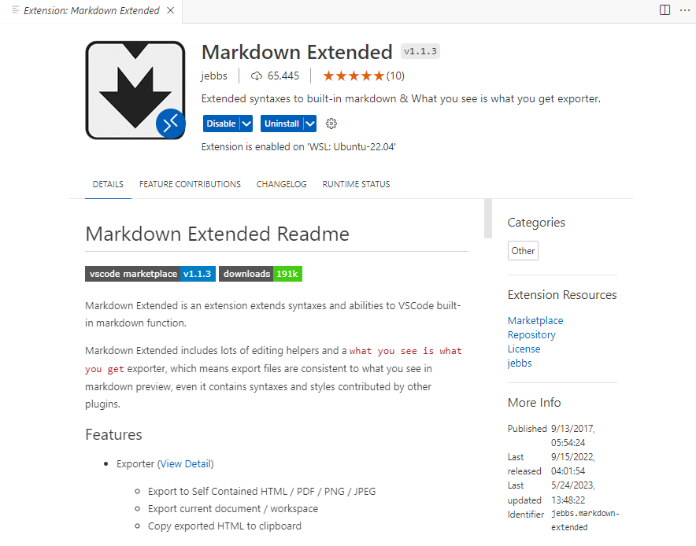

# Basic Markdown

In here we have a basic `Markdown` file, where we just write words, add some basic formatting and they will be rendered in the Markdown previer.

## The previer

`Visual Studio Code` has a native previewer. You can access it by clicking on top right as in following picture:

 

However, it is very basic and does not show the result of some formatting. So, we recommend to install the following extension:

Unluckily, for gitpod we need to use also this extension.

However, you can use any other previer / editor.

## The formatting

The text appear as it is but it can be formatted in some simple modes:

### Paragraphs
By adding a \# level1 you make level 1 for tiles, etc. The above uses /### paragraphs

### Lists

They can be of several types.

This an unordered list, even with multiple levels
- a point
  - another sublevel
    - yet another
    - defc3
  - same sublevel
- anotehr point

This is a numbered list, even with multiple levels 
1. c3evc3
   1. crev
   2. cerwvc3r
   3. cervf3
2. d34f423
   1. dddd
   2. cecfe3fc3
3. 3d3ef2
4. cev3r

This is a task list, even with multiple levels

- [x] ce3vc3
  - [x] cecwe
  - [x] ceceeeeeee
- [ ] ce3vc4231
  - [ ] cewwsss
  - [ ] sssssssss
  - [x] ssffffffffffff
- [x] done

### Text formatting

You can use some formatting such as:

- \*italics* gives *italics*, 
- \**bold** gives **bold**, 
- \~~barred~~ gives ~~barred~~
- \`highlighted\` gives `highlighted`
etc.

