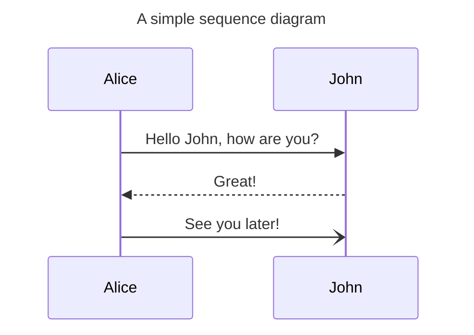
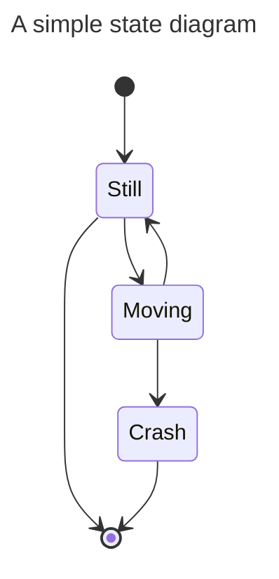
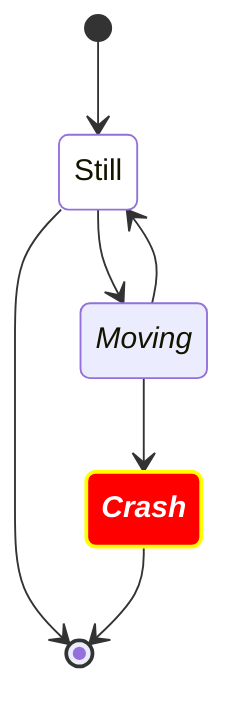

# Advanced Markdown

In here we have a slightly more adavanced `Markdown` file with code snippets, tables, pictures, rendered graphics, formulas, footnotes, etc.


## Code snippets

In here are some examples of code snippets,

```c++
namespace utils {
    
    // it retrieves a value
    bool getit(const &size_t s)
    {
        static size_t _s {0};
        s = _s++;
        return true;
    }

} // namespace utils

```

**Listing**. This is a code listing formatted for C++.

```diff
namespace utils {

-    // it retrieves a value    
-    bool getit(const &size_t s)
+    // it retrieves a values, so we cannot use const !!!!
+    bool getit(&size_t s)
    {
        static size_t _s {0};
        s = _s++;
        return true;
    }

} // namespace utils

```

**Listing**. This is a code listing formatted for diff.


## Tables


In here are some tables with different fromatting


| Name              | Role       | Score |
| ----------------- | ---------- | ----- |
| Bill **Gates**    | Defender   | 0     |
| Steve **Jobs**    | Midfielder | 7     |
| Steve **Wozniak** | Defender   | 3     |
| Paul **Allen**    | Midfielder | 7     |

**Table**. It is a table


|       Name        | Role       | Score |
| :---------------: | :--------- | ----: |
|  Bill **Gates**   | Defender   |     0 |
|  Steve **Jobs**   | Midfielder |     7 |
| Steve **Wozniak** | Defender   |     3 |
|  Paul **Allen**   | Midfielder |     7 |

**Table**. It is the same table with a different alignment

## Pictures

In here is a picture


**Figure**. It is a picture


## Mermaid diagrams

See: https://mermaid.js.org/



**Figure**. Here is a simple sequence diagram. See https://mermaid.js.org/syntax/sequenceDiagram.html



**Figure**. Here is a simple state diagram. See https://mermaid.js.org/syntax/stateDiagram.html



**Figure**. Here is a nicer simple state diagram. See https://mermaid.js.org/syntax/stateDiagram.html


## Use of footnotes

In here are some examples of footnotes[^1]:


Here's a simple footnote,[^2] and here's a longer one[^bignote], yet anotehr one:

> In a hole in the ground there lived a hobbit. Not a nasty, dirty, wet hole, filled with the ends
of worms and an oozy smell, nor yet a dry, bare, sandy hole with nothing in it to sit down on or to eat: it was a hobbit-hole [^4], and that means comfort.


## Formulas


See in [here](https://docs.github.com/en/get-started/writing-on-github/working-with-advanced-formatting/writing-mathematical-expressions) how GitHub uses formulas[^5].

This sentence uses `$` delimiters to show math inline:  $\sqrt{3x-1}+(1+x)^2$

To add a math expression as a block, start a new line and delimit the expression with two dollar symbols $$.

**The Cauchy-Schwarz Inequality**
$$\left( \sum_{k=1}^n a_k b_k \right)^2 \leq \left( \sum_{k=1}^n a_k^2 \right) \left( \sum_{k=1}^n b_k^2 \right)$$


## Notes


[^1]: A footnote may help in adding more details. See its support in [GitHub](https://github.blog/changelog/2021-09-30-footnotes-now-supported-in-markdown-fields/).

[^2]: This is the first footnote.

[^bignote]: Here's one with multiple paragraphs and code.

    Indent paragraphs keeping a new line before to include them in the footnote.

    addd inline code `int a{1};` or also something like that:
    ```C++
    void caller(void *p) { }
    ```
    
    Add as many paragraphs as you like.

[^4]: See in here what is a hottit-hole: <https://en.wikipedia.org/wiki/Hobbit#Lifestyle> "Hobbit lifestyles"    

[^5]: How GitHub uses formulas: https://docs.github.com/en/get-started/writing-on-github/working-with-advanced-formatting/writing-mathematical-expressions
